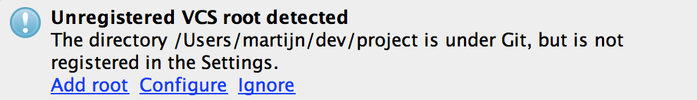

# Repository Setup

While working on your problem definition, you can start creating your development environment. If
you have not done so already, you should setup *git* to share your code with the teaching staff on
a daily basis.

Make sure you have a basic project on GitHub containing all boilerplate code that is generated by
the framework that you are using.

*Put all of your code in a subfolder in your GitHub repository, separate from the **README.md**
etc.*

## Creating a project inside your existing repository

Your repository is required to be neat and tidy. It will contain various documents but also the
code of your project. To add your project in a correct way, please follow these instructions.

For Android Studio:

- make sure you have created your repository as per the instructions
- install and start Android Studio
- close any open projects
- create a "New Project"
  
- choose an appropriate project name (you can't change this later!)
- give your project a *domain* in inverse order: nl.mprog (or anything appropriate)
- then, as your *project location* choose the folder that is the root of your repository
- now, choose an appropriate type of project and create it
- finally, choose *Add Root* in this popup:
  

For Xcode:

- make sure you have created your repository as per the instructions
- install and start Xcode
- close any open projects
- create a "New Xcode Project"
- choose an appropriate template for your project
- choose an appropriate product name (you can't change this later!)
- give your project an *organization identifier* in inverse order: nl.mprog (or anything appropriate)
- choose Swift as your language and select *Next*
- then, as your project location choose the folder that is the root of your repository

Upon following these steps succesfully, you should be able to commit and push the new project to your GitHub repository. Make sure you do this before continuing.
