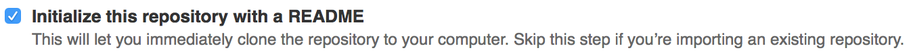
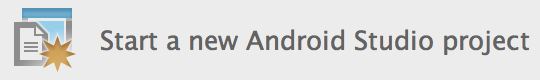

# GitHub

All documentation and code of this project must be hosted on GitHub and updated
daily, in order for the staff to be able to monitor your progress. Please note
that the repository must be public!

## Learning Git

Are you new to Git? Best to head over to [Code School](https://www.codeschool.com/courses/try-git) and do their Git course immediately! For reference, try the [Simple Guide](http://rogerdudler.github.io/git-guide/).

## Creating a new repository

1. Go to <https://github.com/new> and create a new code repository. Check the box to initialize the repository with a readme document:

   

2. Clone the repository to your computer/IDE using **git**.

## Adding pictures

You will need to include some sketches into your proposal. Put these images in a folder called **doc** inside your repository. Use exactly that name, for standards' sake! To use pictures from the `doc` folder in a Markdown document, use the following syntax:

    

## Adding an Android Studio project

- make sure you have created your repository as per the instructions above
- make sure Android Studio is fully up-to-date
- install and start Android Studio
- close any open projects
- create a new project
  
- choose an appropriate project name (you can't change this later!)
- give your project a *domain* in inverse order: nl.mprog (or anything appropriate)
- then, as your *project location* choose the folder that is the root of your repository
- now, choose an appropriate type of project and create it
- finally, choose *Add Root* in this popup:
  

## Adding an Xcode project

- make sure you have created your repository as per the instructions above
- make sure Xcode is fully up-to-date
- install and start Xcode
- close any open projects
- create a "New Xcode Project"
- choose an appropriate template for your project
- choose an appropriate product name (you can't change this later!)
- give your project an *organization identifier* in inverse order: nl.mprog (or anything appropriate)
- choose Swift as your language and select *Next*
- then, as your project location choose the folder that is the root of your repository

## Adding a D3-based project

- create a folder inside your repository that is named after your project
- create folders there for the kinds of source files you will have: **css** and **javascript** are likely candidates
- if your application will be implemented in one or only a few **html** files, simply put these in the project folder
- make sure there is a *main* html file that is called **index.html**
