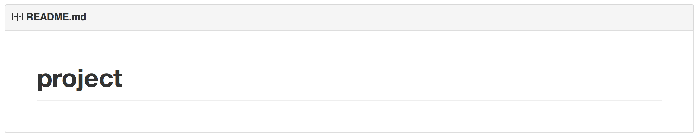

# Markdown

Need some help with Markdown? At its core, it is a very simple way of formatting plain text documents. The nice thing is that, if you do this consistently, GitHub (and other tools) can make a very nice and clean HTML version of that document!

If you have made your repository to include an example **README.md**, it will contain this text:

    # project

Boring! However, if you go to github.com and view your repository, you'll see below the file list that it has rendered your plain text file into a nice layout (even though it's still boring!).

If you update the **README.md** on your computer and *push* it to GitHub, a newly rendered version will be available instantly!

## Reference

Now, you may have inferred that using **#** marks will generate *headers* for your document. How do you make subheadings and nice lists? Simply refer to the basic Markdown documentation:

<http://daringfireball.net/projects/markdown/>

On GitHub, you can also use a couple of extra features that are documented here:

<https://guides.github.com/features/mastering-markdown/>

## Images

One special note about images: if you put images in a subfolder of your repository, these will be put online in very ugly URLs. But! GitHub helps us a bit here. To include images from the **doc** folder, simply add this code into your document:

    
